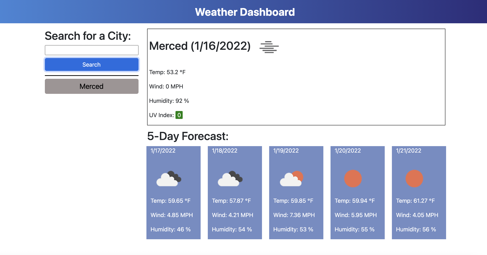

# Weather-Dashboard

## Purpose
To create a weather application that will make an API call from a third party api to retrieve the data about the current weather and 5 day forecast. The application will let the user enters in any city that the user wants to know about the current and future forecast for that city. So the user can plan ahead. It will display the user the informations that the user need to know about current weather and 5 day forecast.

## Built With
- Html
- Css, Bootstrap
- jQuery
- Weather API
- Moment.js

## Website Link
https://p-her.github.io/weather-dashboard/

## Github Link
https://github.com/p-her/weather-dashboard
